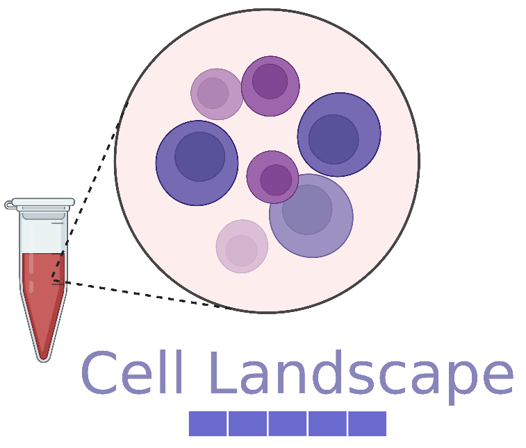

# cellLandscape

## Overview

<p>
  
</p>

## Description
Here we can automatically summarize the overall cellular landscape of a sample profiled with a single-cell technology (e.g. CyTOF, Flow Cytometry, scRNA-seq) with a single feature vector. Such feature vectors can therefore be used in downstream tasks, such as for prediction of clinical or experimental outcomes. Our method, originally introduced in in our 2022 [ACM-BCB 2022 paper 'Transparent Single-Cell Set Classification with Kernel Mean Embedding'](https://dl.acm.org/doi/10.1145/3535508.3545538) paper offers an unsupervised approach for summarizing nuances of cellular heterogeneity across multiple profiled samples. Our method is clustering and gating free and simply requires original data matrices of cells x features as inputs. Breiefly, the summarization works by computing a Kernel Mean Embedding on Random Fourier Features. 

## Installation
Dependencies 
* Python >= 3.6, anndata 0.7.6, numpy 1.22.4, scipy 1.7.1, tqdm 4.64.0, scanpy 1.8.1

You can clone the git repository by, 

```
git clone https://github.com/CompCy-lab/cellLandscape.git
```

## Example usage
To compute the kernel mean embedding, first read in a preprocessed `.h5ad` object. This dataset contains multiple profiled single-cell samples. That is, the .h5ad file contains cells across all samples.

```python
import scanpy as sc
adata = sc.read_h5ad('nk_cell_preprocessed.h5ad')
```
Then simply compute the kernel mean embedding as,

```python
# Inputs:
# adata: annotated data object (dimensions = cells x features)
# sample_set_key: string referring to the key within adata.obs that contains the samples to compute the embedding
#   ~ If sample_set_key is None, will use all cells as a single sample 
# gamma: scale for standard deviation of the normal distribution within random Fourier frequency feature computation  
# D: dimensionality of the random Fourier frequency features, D/2 sin and D/2 cos basis 
# frequency_seed: random state parameter 
# -----------------------
    
# Returns:
# X_embed: mean embedding (dimensions = samples x D)

# -----------------------
from embed import mean_embed
X_embed = mean_embed(adata, sample_set_key = 'FCS_File', gamma = 1, D = 2000, frequency_seed = 0)
```
